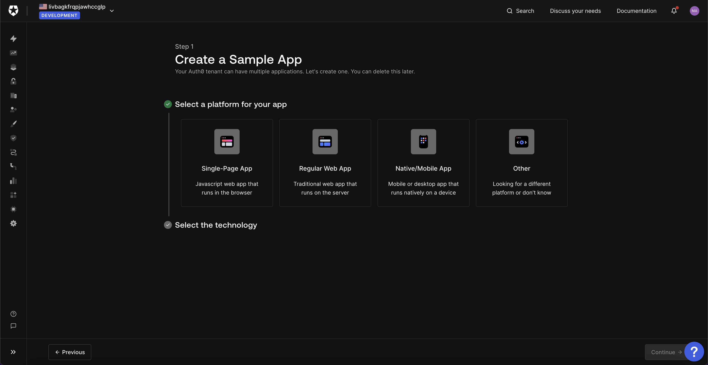
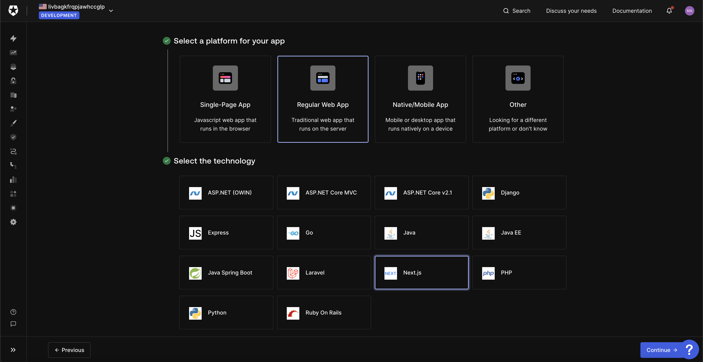
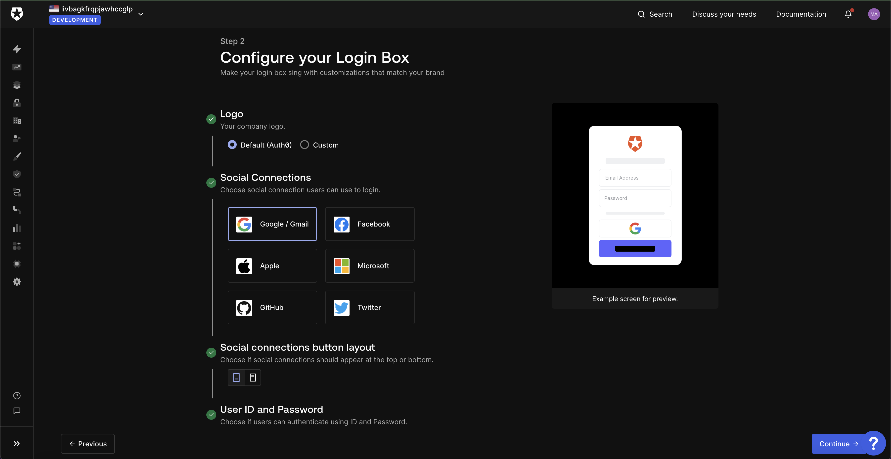
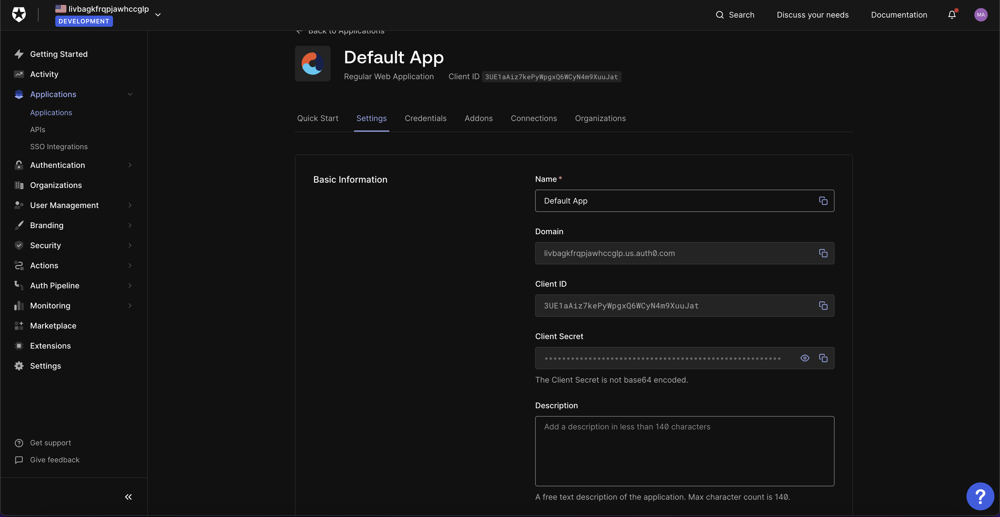
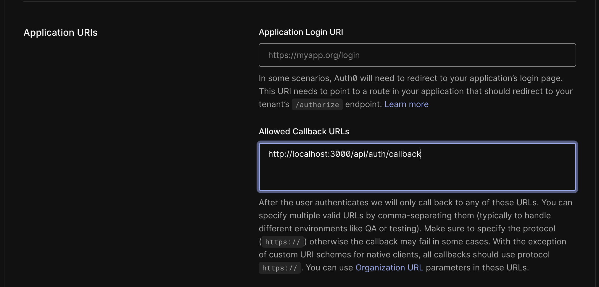
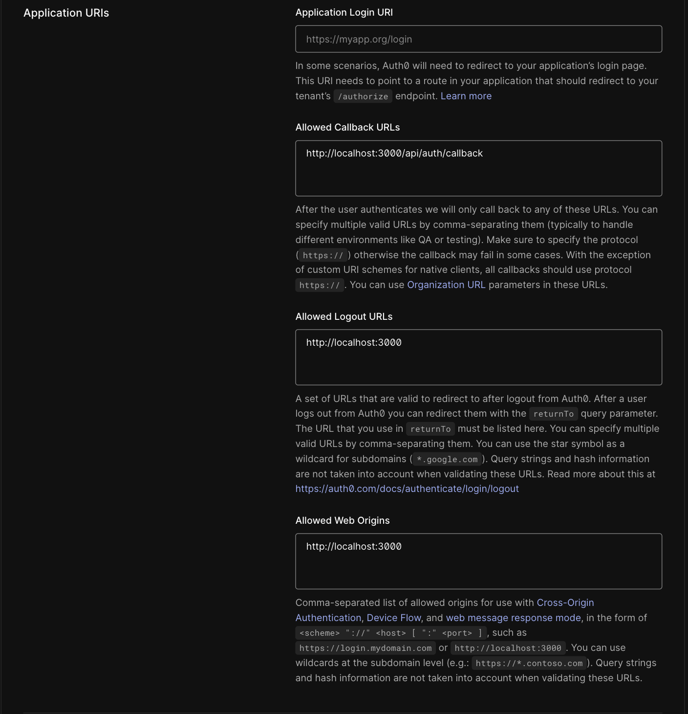
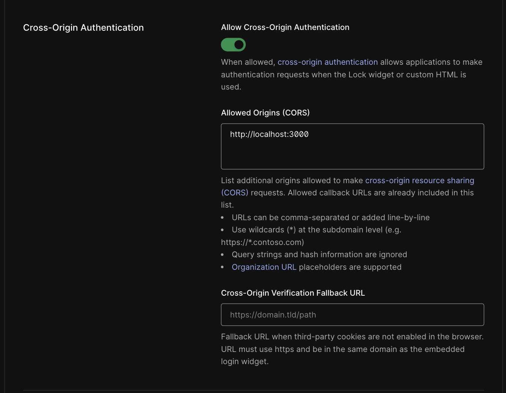

This is a [Next.js](https://nextjs.org/) project bootstrapped with [`create-next-app`](https://github.com/vercel/next.js/tree/canary/packages/create-next-app).

## Getting Started

This app requires the back end set up and running. Once you've set up the back end, continue with the instructions.

First, install the npm dependencies using the command line and running the following inside the 'MyFirstBlogFrontEnd' directory:

```bash
npm install
```

Next, create a new file named `.env.local` and copy the contents of the  `.env.local.example` file into it. We'll be filling in the missing entries throughout this setup.

Ensure the backend server is running.

Then, run the development server:

```bash
npm run dev
```

Finally, open [http://localhost:3000](http://localhost:3000) in your browser to view the website.

You can start editing the page by modifying `pages/index.js`. The page will automatically update as you edit the file.

### Authentication

#### Auth0 project setup
To enable authentication, create an account with [Auth0](https://auth0.com/). 
The registration process will have you create a default app. 

1. Create a Regular Web Application with NextJs.
   

2. Choose NextJs as the technology
   

3. You can press continue on the next page. You can modify the login box in the future if you wish.
   

4. Test out the login box to see how it works when it's set up properly.

5. Next, navigate to the application's page.
      * All your applications, reachable through the sidebar:
   
      * The application page:
   

6. Fill in your `.env.local` file with the tokens found on the settings page
    * `REPLACE_WITH_AUTH0_DOMAIN` should be replaced with the `Domain` value from the settings page. Make sure the full variable starts with `https://`
    * `REPLACE_WITH_AUTH0_CLIENT_ID` should be replaced with the `Client ID`
    * `REPLACE_WITH_AUTH0_SECRET` should be replaced with the `Client Secret`

7. Add `http://localhost:3000/api/auth/callback` to the `Allowed Callback URLs`
   

8. Add `http://localhost:3000` to the following in the auth0 application settings dashboard:
   1. `Allowed Logout URLs`
   2. `Allowed Web Origins`
   3. `Allowed Origins (CORS)`
   * The Application URIs section should look like this:
     
   * The Cross-Origin Authentication section should look like this:
     

9. Save the changes to the auth0 application

10. Test by starting up the server using `npm run dev`, navigating to [http://localhost:3000](http://localhost:3000), clicking the login button, 
    and either signing up as a new user or signing in with your google account

## Learn More

To learn more about Next.js, take a look at the following resources:

- [Next.js Documentation](https://nextjs.org/docs) - learn about Next.js features and API.
- [Learn Next.js](https://nextjs.org/learn) - an interactive Next.js tutorial.

You can check out [the Next.js GitHub repository](https://github.com/vercel/next.js/) - your feedback and contributions are welcome!

To learn more about the technologies used in this site, see the following resources:

- [Tailwind CSS](https://tailwindcss.com/docs) - the official Tailwind CSS documentation
- [Next.js](https://nextjs.org/docs) - the official Next.js documentation
- [Headless UI](https://headlessui.dev) - the official Headless UI documentation
- [MDX](https://mdxjs.com) - the MDX documentation
- [Auth0](https://auth0.com/docs/) - the Auth0 documentation
